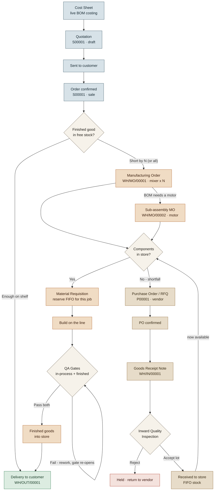

# KMForge — End-to-End Connected Flow

The full lifecycle of an order, from costing to dispatch, showing how Sales,
Production, and Procurement/Inbound connect — including the two loops that make
it a *system* rather than separate screens:

- **Buy → store → make loop:** a component a job needs isn't in store → a PO is raised → goods
  are received (GRN) → inspected (Inward QC) → stocked → the job can now reserve it.
- **Rework loop:** a QA gate fails → it re-opens → the batch is re-inspected before it can close.

## The three lanes

| Lane | Screens | Documents |
|------|---------|-----------|
| **Sales** | Cost Sheets · Orders & Quotes | `S#####` |
| **Production** | Production · Material Requisition · Quality Gates · Can I Build? | `WH/MO/#####`, `WH/OUT/#####` |
| **Procurement / Inbound** | Purchasing · Goods Receipt | `P#####`, `WH/IN/#####` |

## Reading order (the happy path)

1. Price the product on its **Cost Sheet**; that price flows into a **Quotation**.
2. Confirm the quote → **Sales Order**. The system checks stock (*net requirements*).
3. If short, a **Manufacturing Order** is raised — plus a nested **sub-assembly MO** for the motor.
4. The job needs components: those in store are **reserved (FIFO)**; those short trigger a **Purchase Order**.
5. The PO is confirmed → a **Goods Receipt (GRN)** appears → **Inward Quality Inspection** accepts or rejects the lot.
6. Accepted goods land in the **store (FIFO)** and become available to the waiting job.
7. The job builds, passes the mandatory **QA Gates**, and the finished goods move to stock.
8. Finished goods are **delivered** to the customer.
